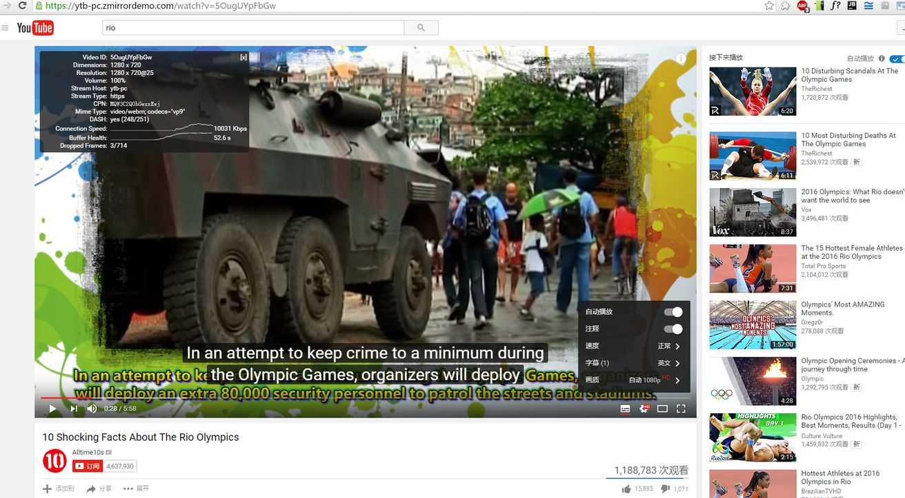

# zmirror-screenshot
 

## Youtube mirror

### an 1080P video
  

zmirror's Youtube mirror is fully support HD, as well as many other Youtube functions  
[click me for raw pic](img/screenshot-youtube-1080p.jpg)  

## Google mirror

### Rio Olympic
  

The Google doodle and the Olympic special component works perfectly.  
Well, honesty, I myself was surprised when I first saw the doodle and component.  
They were not *PLANNED* to be supported, actually, there is not any code or settings for doodle or the component,  
nothing but just the builtin powerful generic rules.  

[click me for raw pic](img/screenshot-google-rio-olympic.png)  

### Zhejiang University
  

[click me for raw pic](img/screenshot-google-zju.jpg)  
